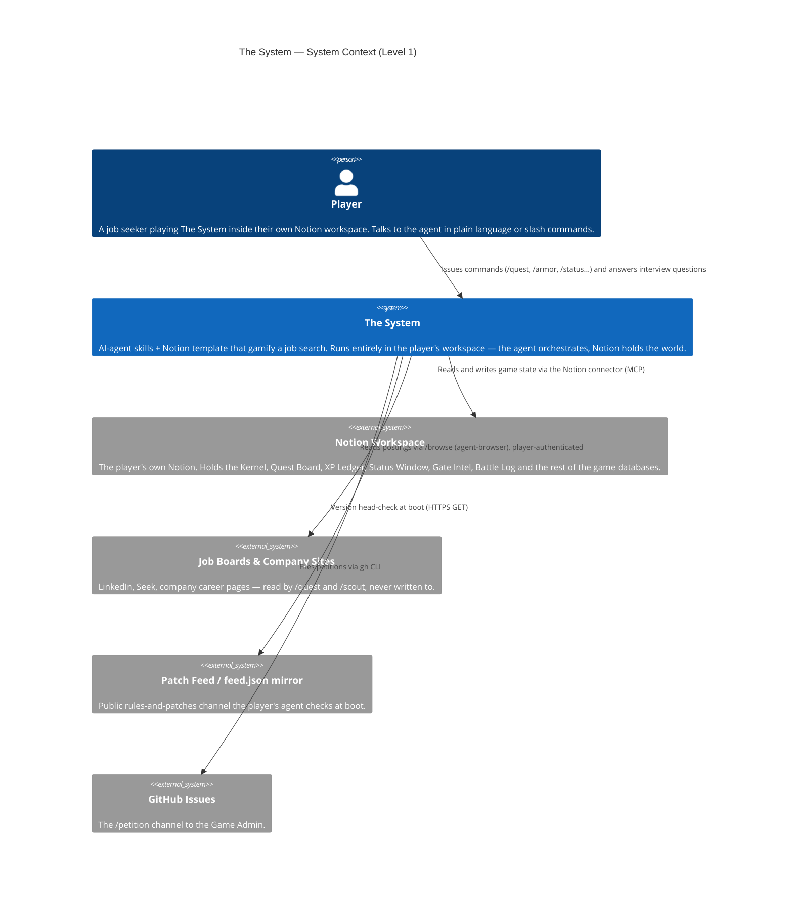
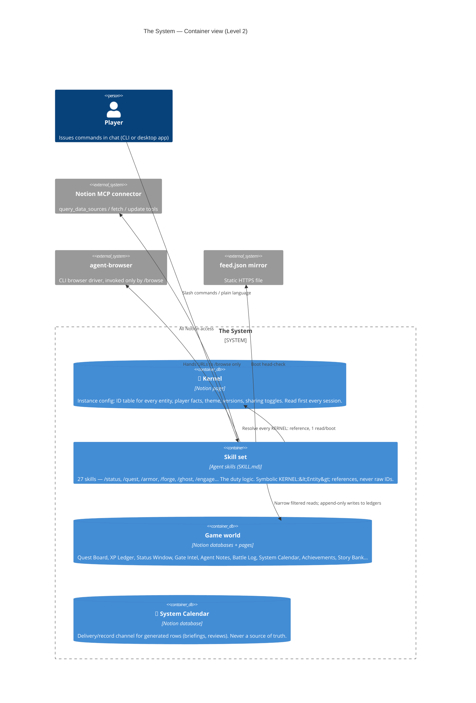

# Architecture

C4 model views of The System's two most intricate surfaces: the **Status Window** (the always-current player card that renders at the top of every new or stale chat) and the **Job Application Flow** (the command chain that takes a posting from link to submitted application).

| Document | What it covers |
|---|---|
| [status-window.md](status-window.md) | HLD + LLD of the rich status window: render spec, data sources, freshness rule, component + sequence diagrams |
| [job-application-flow.md](job-application-flow.md) | HLD + LLD of the application flow: the real command chain, application state machine, suggest-vs-auto-execute rules, per-stage sequences |
| [c4-deep-dives.html](c4-deep-dives.html) | Standalone HTML rendering of the diagrams that don't fit one mermaid block cleanly (open the raw view or download to view) |

## Level 1 — System Context

Who uses The System and what it touches. One player, one agent, one world.

**Key boundary:** everything the player can see lives in *their own* Notion workspace. The agent holds no game state; it is stateless between sessions except for what the Kernel records.

## Level 2 — Containers

The System decomposes into three containers: the skill set (the logic), the Notion workspace (the state), and the runtime services the skills reach.

### The one-sentence shape

**Notion holds the world; the skills are the duty logic; the Kernel is the session's keyring.** Every skill reads the Kernel first, resolves symbolic references against the Kernel's Instance ID table, and does narrow filtered reads against the world — never a full-database pull. Nothing holds state outside the player's workspace.

### Reading the deep dives

- **[status-window.md](status-window.md)** starts with the *rich status window* design: what renders at the top of every new or >1-day-stale chat, how it differs between CLI (ANSI table) and desktop (markdown table), which four Notion surfaces feed it, and the freshness/staleness decision rules.
- **[job-application-flow.md](job-application-flow.md)** derives the *real* chain from the skills themselves — it is not the naive `/quest → /armor → /forge → /ghost` reading; `ghost` is embedded inside both `armor` and `forge` as a mandatory pass, and the actual gate before building is `/appraise`.
