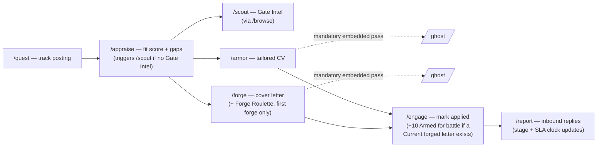
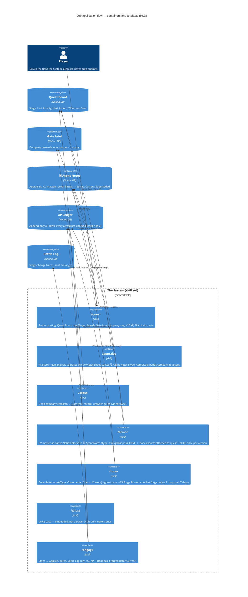
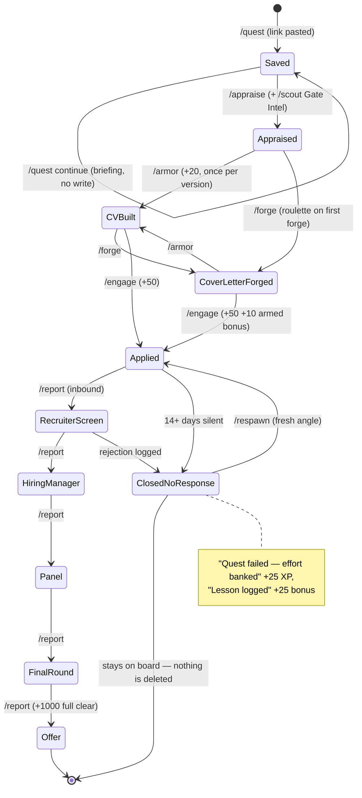
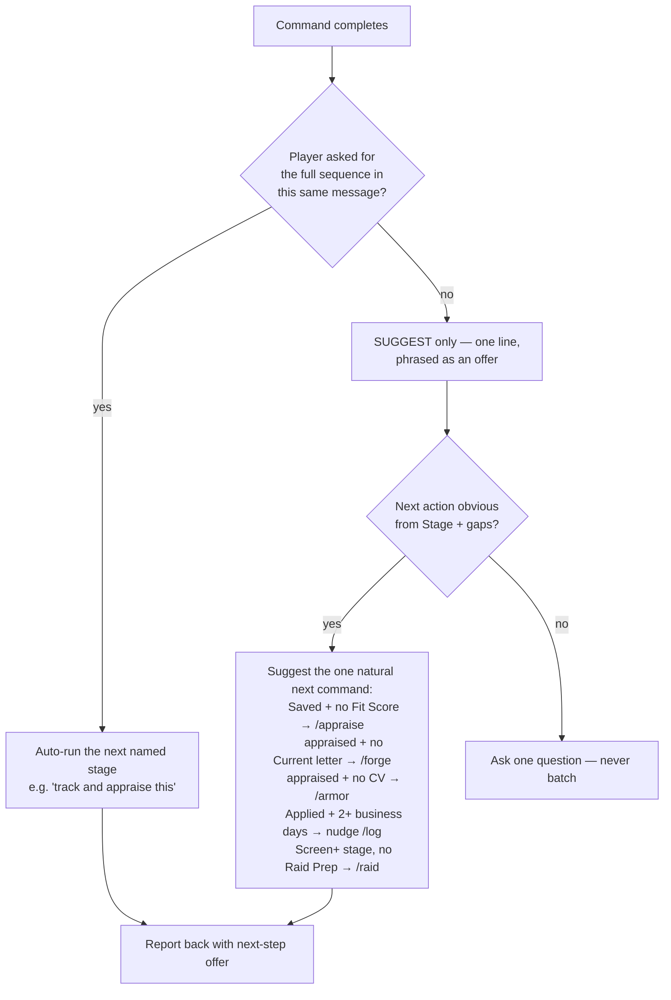
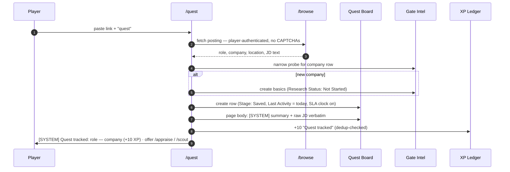
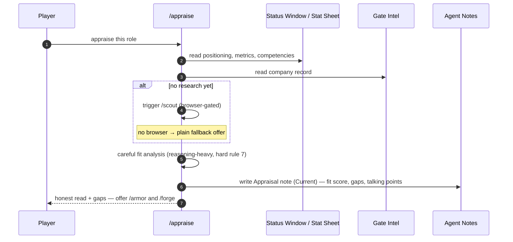
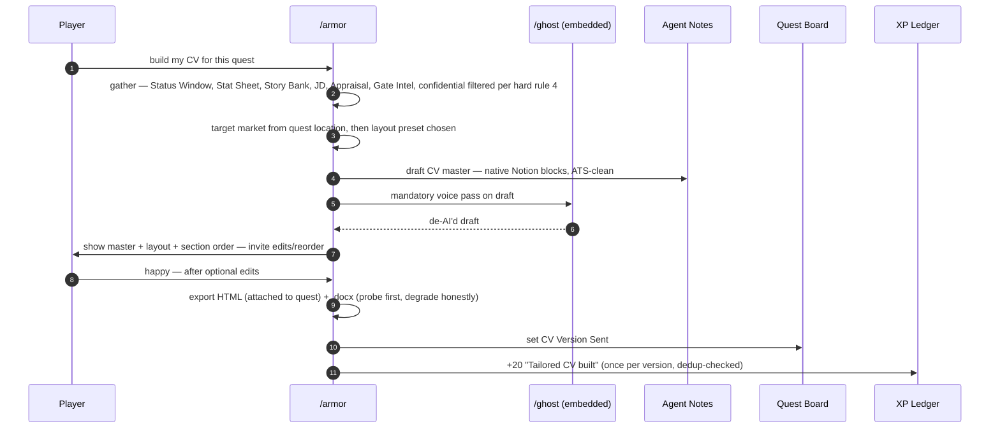
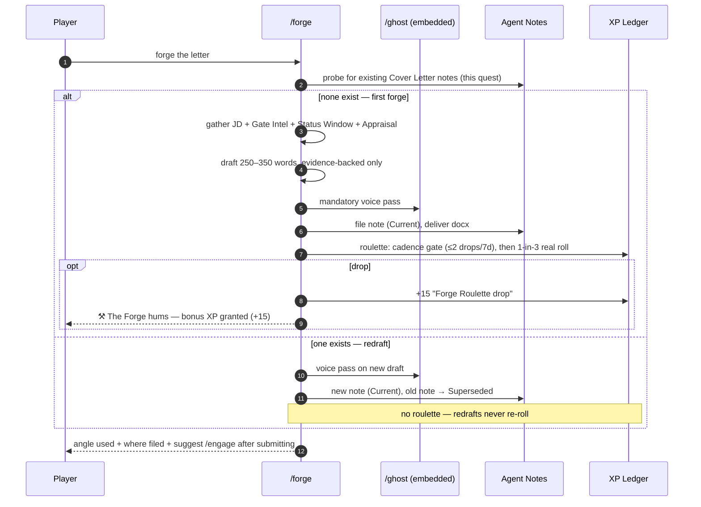
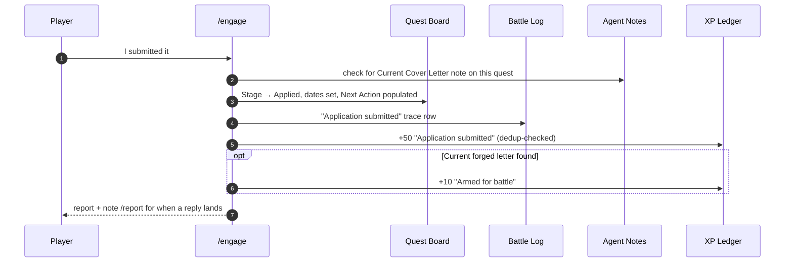

# Job Application Flow — HLD + LLD

Architecture doc for the end-to-end flow that takes a job posting from *link* to *submitted application*. The chain below is derived from the skills themselves (`quest/SKILL.md`, `armor/SKILL.md`, `forge/SKILL.md`, `ghost/SKILL.md`), not from the intuitive reading — one important correction to the naive mental model comes out of that.

Related: [C4 overview](README.md) · [Status window](status-window.md) · [HTML deep dives](c4-deep-dives.html)

---

## 1. The real command chain

**The naive reading** — `/quest → /armor → /forge → /ghost` as four sequential commands — is wrong in two ways:

1. **`/ghost` is not a stage.** It is a *mandatory embedded pass* inside both `/armor` (step 4 of the armor procedure) and `/forge` (step 5). Players never invoke it in this flow; it exists standalone only for de-AIing arbitrary text.
2. **`/appraise` is the gate.** `/quest` explicitly ends with "ask if the player wants /appraise and/or /scout run next", and both builders pull the Current appraisal note as a primary input. Building armor on an un-appraised quest loses the strongest talking points.

**The real chain:**

Player-observable shorthand: **track → appraise → build → submit → respond.** `/armor` and `/forge` are independent siblings after appraisal (either can go first; a player can apply without one of them — `/engage` only *bonuses* for a Current forged letter, it doesn't require it).

## 2. HLD — container view of the flow

## 3. Application state machine (LLD)

One tracked quest moves through the Quest Board's `Stage` property. The flow commands are the transitions; `/report` and `/respawn` are the event-driven branches.

**Invariants held across all transitions:**
- Every XP award is **pre-checked against the Ledger** for the same (action, quest) key — reruns never double-award (hard rule 2).
- Every stage change writes a **Battle Log trace** and updates `Last Activity` (hard rule 9).
- Every active quest keeps `Next Action` / `Next Action Due` populated.
- Nothing is ever deleted; supersession (old CV/letter notes → `Status: Superseded`) is the only form of "replace".
- The System **never submits** anything — `/engage` records a submission the *player* made (hard rule 1).

## 4. Suggest vs auto-execute — decision rules

The flow's contract: **suggest the next step, never silently run it** — with one bounded auto-execute exception. Derived from the skills' own handoff language ("ask if the player wants /appraise and/or /scout run next", "don't run them automatically unless they've already asked for the full sequence in the same message"):

**Hard bounds on auto-execution:**
1. Same-message intent only ("run the whole chain on this") unlocks auto-run of the *named* stages; each stage still reports its own result.
2. Never auto-execute anything that writes employer-facing documents without showing the draft first (`/armor`, `/forge` always end in "only export once they're happy").
3. Never auto-execute browser-gated stages (`/scout`) when `/vitals` reports no browser — offer the fallback wording instead.
4. The status window's **Next action** line (see [status-window §2](status-window.md#2-data-sources--one-number-one-home)) is always a *suggestion* — an offer, never an order, never an overdue item for pre-contact quests (no SLA flags at `Saved`/`Applied`).

## 5. Sequence diagrams per stage

### 5.1 `/quest` (track)

### 5.2 `/appraise` (+ `/scout`)

### 5.3 `/armor` (CV)

### 5.4 `/forge` (cover letter)

### 5.5 `/engage` (submit + close the loop)

## 6. Handoffs and failure edges

| Edge | Behaviour |
|---|---|
| `/forge` or `/armor` on an untracked role | Offer `/quest` first — never build for untracked roles |
| `/forge` on a quest with no Current appraisal | Proceed, but note the appraisal would sharpen it; offer `/appraise` |
| `/scout` needed but no browser | `/browse`'s exact fallback wording — paste the page text instead; never invent research |
| `.docx` builder absent | Say so plainly, deliver HTML; never fall back to an arbitrary library (public #64 lesson) |
| Player goes quiet mid-flow | The status window's Next-action line re-offers the interrupted stage next session |
| Quest goes 14+ days silent | Stage → `Closed – No Response`; `/respawn` offered; +25 effort-banked XP, nothing deleted |
