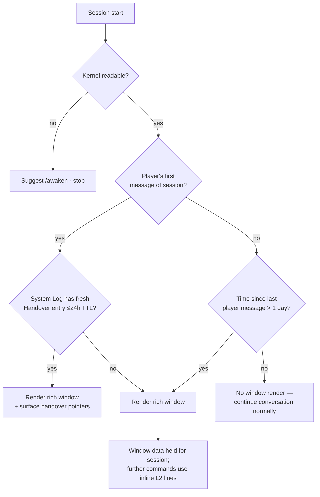
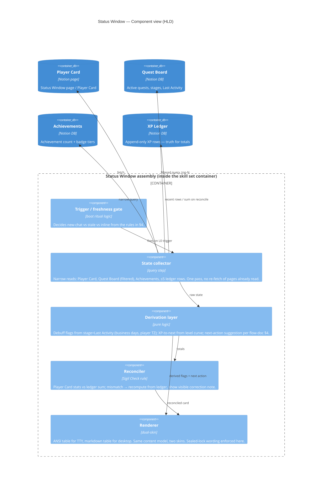
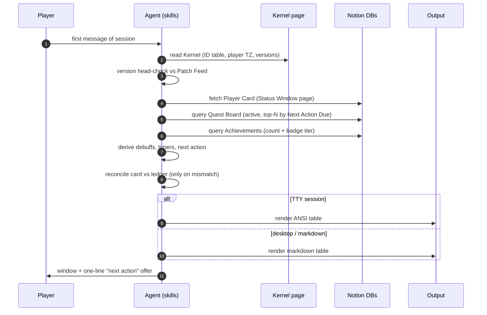
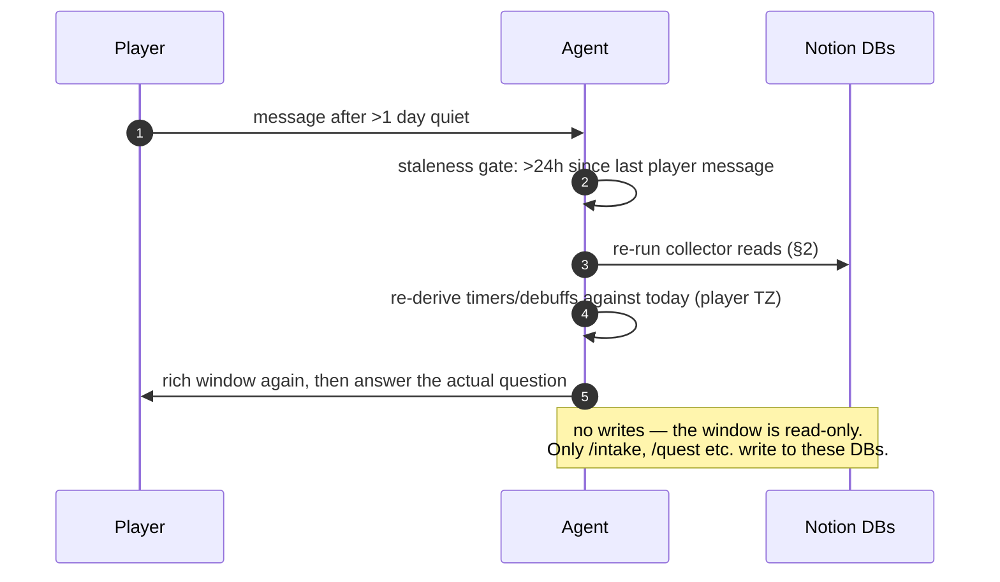

# Status Window — HLD + LLD

Architecture doc for the **rich status window**: the player-card render that appears at the top of every new chat, and again whenever a chat is stale (more than one day since the last exchange). Player-facing behaviour already shipped in `/status` and the boot ritual; this document specifies the *designed* surface — what it includes, where every number comes from, and how it renders on both CLI and desktop apps.

Related: [C4 overview](README.md) · [Job application flow](job-application-flow.md) · [HTML deep dives](c4-deep-dives.html)

---

## 1. What the status window is

The status window is **not** the `/status` command alone. It is a layered surface:

| Layer | Trigger | Content | Cost |
|---|---|---|---|
| **L0 — Rich window** | Every new chat, or a stale chat (>1 day since last player message) | Full player card table + active quests + next recommended action + debuffs/timers | ~4 narrow reads |
| **L1 — `/status` command** | Player says "show my status" | Same card, read-only, on demand | Same reads, on demand |
| **L2 — Inline mention** | Any command report-back | One line: `[SYSTEM] Quest tracked: <role> (+10 XP)` | free |

The L0 layer is what makes The System feel like a game console rather than a chatbot: the player never has to ask "where am I?" — the first thing on screen is the card.

## 2. Data sources — one number, one home

Every rendered value has exactly one source of truth. The window **never recomputes** what Notion already owns, and never displays a stat that can't be traced:

| Rendered field | Source | Read pattern |
|---|---|---|
| Level, Rank | Player Card (`KERNEL:Status Window` page, Player Card table) | one page fetch |
| Total XP, XP to next level | Player Card; **reconciled** against `sum(XP)` from XP Ledger on mismatch — ledger wins, correction is visible (Sigil Check rule) | Player Card first; ledger sum only on mismatch |
| Streak | Player Card (`5-weekday streak` rules from the XP table) | Player Card |
| Debuffs (🟠 Hesitation / 🔴 Fading Gate / 🔔 Cooling Ally) | Pipeline state derived from Quest Board stage + SLA clock — computed, not stored | Quest Board filtered read |
| Active quests | `KERNEL:Quest Board` — rows not in `Closed`/`Offer`, top 3 by `Next Action Due` | narrow filtered query |
| Next recommended action | Computed from the highest-priority active quest: stage + missing prerequisites (see [flow doc §4](job-application-flow.md#4-suggest-vs-auto-execute-decision-rules)) | already-read data |
| Timers / SLA flags | `date:Last Activity:start` per quest, business-day math in the player's timezone (Kernel Player section) | same quest rows |
| Achievements / Badges | `KERNEL:Achievements` — `Kind: Achievement` count (N/12) and `Kind: Badge` tier summary | one narrow query |
| Recent unlock | XP Ledger, most recent row(s) if relevant | narrow query, ≤5 rows |

**Anti-patterns (forbidden):** recomputing level from raw XP when the Player Card is plausibly current; storing debuffs anywhere; pulling the full XP Ledger history; guessing "today" — dates come from the actual clock in the player's timezone per the Kernel.

## 3. Render spec

### 3.1 The table (both surfaces, same content, different skin)

```text
┌─ [SYSTEM] STATUS ──────────────────────────────────────────────
│ Level 5 · C-Rank          ⚡ 1,240 XP   next: 2,000 (760 to go)
│ 🔥 Streak: 4 weekdays     🏅 Achievements 5/12 · Badges 3/6 tracks
├─ Active quests ───────────────────────────────────────────────
│ ⚔️ Senior Eng @ Acme      Applied · 3d quiet    nudge due soon
│ ⚔️ PM @ Northwind         Saved   · appraised   → /forge?
├─ Timers ──────────────────────────────────────────────────────
│ 🟠 none   🔴 none   🔔 Cooling Ally: Acme (until Fri)
├─ Next action ─────────────────────────────────────────────────
│ → Forge the cover letter for PM @ Northwind — say "/forge".
└───────────────────────────────────────────────────────────────
```

On **desktop / markdown surfaces** this renders as a markdown table (GitHub-flavoured, Notion-pastable); on **CLI** it renders with ANSI colour on the same layout. Content is identical — only the skin differs — so the "what does this mean" is learnable once.

### 3.2 CLI skin (ANSI)

| Element | Treatment |
|---|---|
| Header line `[SYSTEM] STATUS` | bold + system accent colour |
| Level / Rank | bold |
| XP bar (text bar `▮▮▮▯▯` or fraction) | dim; turns accent colour within 10% of a level-up |
| Debuffs | 🟠 yellow / 🔴 red / 🔔 cyan — **colour is decoration only; the emoji + label carries the meaning** (colour-blind safe, and survives plain-text fallbacks) |
| Active quest lines | one line per quest: `⚔️ <role> @ <company> — <stage> · <age> · <hint>` |
| Next action | bold, prefixed `→`, always phrased as an offer ("say /forge") never an order |

ANSI is emitted only when the session's output is a TTY; when redirected or when the desktop app renders markdown, the plain/markdown skin is used. The agent detects surface class the same way it already probes capabilities (`/vitals` philosophy): **probe before claiming** — emit markdown if unsure, since markdown degrades gracefully in a terminal and ANSI codes do not render in Notion.

### 3.3 Desktop skin (markdown table)

```markdown
**[SYSTEM] STATUS** — Level 5 · C-Rank · ⚡ 1,240 XP (760 to next) · 🔥 streak 4

| ⚔️ Quest | Stage | Quiet for | Note |
|---|---|---|---|
| Senior Eng @ Acme | Applied | 3d | follow-up due soon |
| PM @ Northwind | Saved | — | appraised → `/forge`? |

**Debuffs:** 🔔 Cooling Ally — Acme (until Fri) · **Next:** forge Northwind's cover letter — say `/forge`.
```

Rules that hold on both skins:
- **Numbers, then a line of colour** — never a full re-explanation of the game system.
- **Sealed content** renders only as its lock wording (`🔒 SEALED — clears at Lv. N`); the window never hints at values.
- **Wellbeing > engagement > XP**: quiet mode suppresses the theatrical framing but keeps the factual card.
- **Every claim traceable** to a row or page listed in §2. If a value can't be read, the window says so plainly rather than showing a stale number.

## 4. Freshness rule (L0 trigger)



**Staleness definition:** >1 day (24h) since the player's last message in this session. Rationale: quest `Last Activity` clocks and debuff timers are date-grained; a chat older than a day may have stale SLA flags, so re-reading is cheaper than being confidently wrong. Within the same day, re-rendering on every message would be noise — the window renders once per session-opening (or per staleness event), and further updates ride inline on command reports.

**Failure behaviour:** if any source read fails, the window renders with that section marked unavailable (`— unavailable right now`) rather than omitting silently or showing last-known-good values. One line, plain language, move on.

## 5. HLD — component view



## 6. LLD — boot-time sequence



## 7. LLD — staleness re-render sequence



## 8. Design constraints recap

1. **Read-only.** The window never writes. Writers are the earning commands.
2. **Deterministic-first.** Notion formulas (once verified) are read, never re-derived; the SLA carve-out (unverified formulas) is honoured — own date math governs for now.
3. **One skin of truth.** CLI and desktop differ in encoding only; both derive from the same collected state in the same pass.
4. **Leak-safe by construction.** No sealed values, no admin vocabulary, no raw IDs in output — the public-repo leak gate applies to this repo's docs, and the same discipline applies to window output (locked entries use registered lock wording only).
5. **Graceful degradation.** Every failed read degrades to a visible "unavailable" mark, never to silence or invented values.
